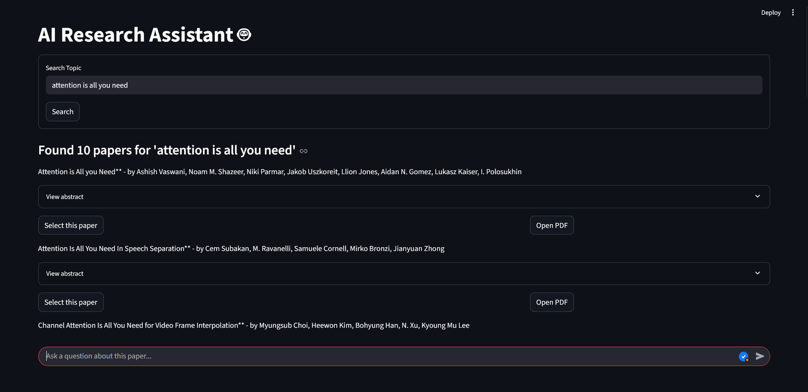
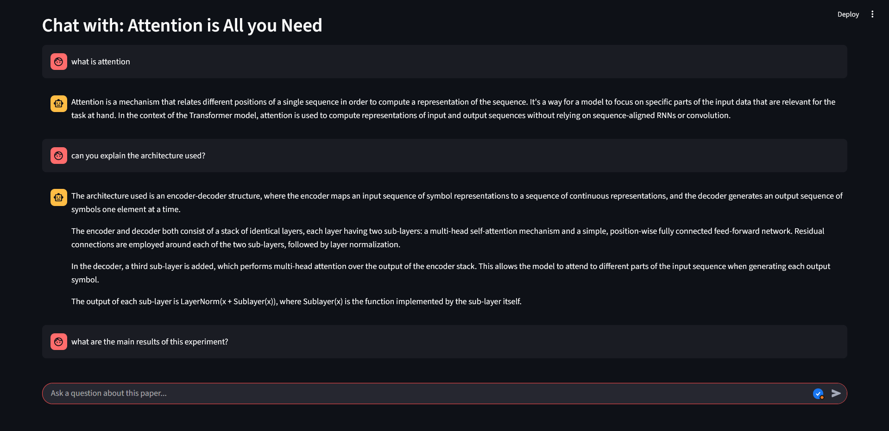

# AI Research Assistant 🤖

A free, open-source AI-powered research assistant that helps you **search for academic papers**, **chat with any selected paper to learn more about it without reading the full text**, and **ou can also view the PDF of the paper.**
This tool acts as a personal research assistant, helping you quickly understand and query academic documents using the power of Large Language Models (LLMs).
Built with [Streamlit](https://streamlit.io/), [LangChain](https://python.langchain.com/), and [Semantic Scholar](https://www.semanticscholar.org/).

---

## Features

- 🔍 **Search** for recent and relevant research papers by topic (via Semantic Scholar)
- 📄 **Read** abstracts, authors, and access full PDFs
- 🤖 **Chat** with an LLM about the content of any selected paper (context-aware Q&A)
- 🧠 Uses vector embeddings for accurate retrieval-augmented generation

---

## Demo

<p align="center">
  
  
</p>

---

## Getting Started

### 1. Clone the repository

```bash
git clone https://github.com/yourusername/ai-research-assistant.git
cd ai-research-assistant
```

### 2. Install dependencies

```bash
pip install -r requirements.txt
```

**Or install manually:**
```bash
pip install streamlit langchain langchain-community faiss-cpu sentence-transformers python-dotenv requests tqdm
```

### 3. Set up API keys

Create a `.env` file in the project root with the following content:

```
GROQ_API=your_groq_api_key_here
```

- **GROQ_API**: Get your [Groq API key](https://console.groq.com/keys) for LLM access.

### 4. Run the app

```bash
streamlit run app.py
```

---

## Usage

1. **Enter a search topic** in the search bar and click "Search".
2. **Browse the list of papers** found.
3. **Select a paper** to load its PDF and prepare it for Q&A.
4. **Ask questions** about the paper in the chat interface.

---

## File Structure

```
.
├── app.py              # Streamlit app UI and logic
├── retriver.py         # Paper search, PDF processing, and Q&A functions
├── requirements.txt    # Python dependencies
└── README.md           # This file
```

---
## How It Works

1.  **Search:** The user enters a topic. The `retriever.py` script sends a request to the **Semantic Scholar API** to fetch a list of relevant papers.
2.  **Select:** The user selects a paper from the search results. The application retrieves the PDF link for that paper.
3.  **Ingest & Vectorize:**
    *   `PyPDFLoader` downloads and loads the text content from the paper's PDF.
    *   `RecursiveCharacterTextSplitter` breaks the long document into smaller, manageable chunks.
    *   `HuggingFaceEmbeddings` converts these text chunks into numerical vectors (embeddings).
    *   `FAISS` stores these vectors in an efficient, searchable index (the vector store).
4.  **Chat (RAG):**
    *   The user asks a question about the selected paper.
    *   The **FAISS vector store** retrieves the most relevant text chunks from the paper based on the question's semantic meaning.
    *   The **LangChain RAG chain** takes the user's question and the retrieved chunks and passes them to the **Llama 3 model** via the Groq API with a specific prompt.
    *   The LLM generates an answer based *only* on the provided context, which is then displayed to the user.

## Credits

This project uses and adapts code from:

> **RESP: Research Papers Search**  
> Ankit Pal (2021)  
> [https://github.com/monk1337/resp](https://github.com/monk1337/resp)  
> *Fetch Academic Research Papers from different sources including Google Scholar, ACL, ACM, PMLR etc based on keywords or title.*

If you use this project in your own work, please also consider citing RESP:

```bibtex
@misc{Resp2021,
  title = {RESP : Research Papers Search},
  author = {Pal, Ankit},
  year = {2021},
  howpublished = {\url{https://github.com/monk1337/resp}},
  note = {Fetch Academic Research Papers from different sources including Google Scholar, ACL, ACM, PMLR etc based on keywords or title}
}
```

---

